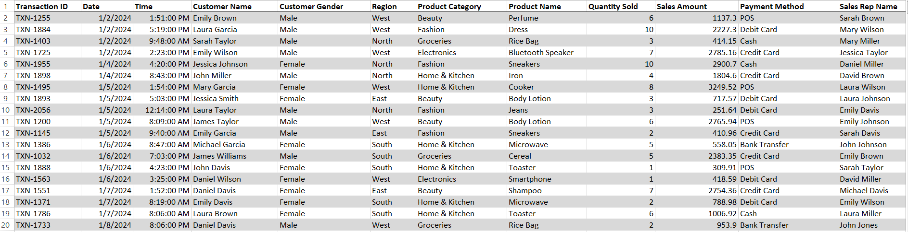
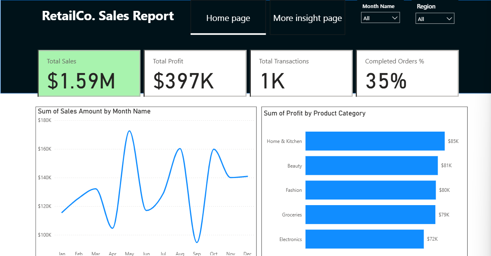

# Retail Co Sales Report (Jan-Dec 2024)
Analysis of the sales dataset to give management a better view of the business performance.

## Executive Summary
 - Retail Co lacked the required structure that will enable them to make accurate data driven decisions for their business.
 - Developed an interactive Power BI dashboard consolidating their over 1000 transactions to accurately track their KPIs, understand their customer behaviour and notice their sales trend. 
 - The analysis highlighted a major issue in their business as about 65% of all orders get returned. Leaving only a small 35% of orders as completed.

## Business Problem
Retail Co is a major retail store making business decisions based on intuition and actions not backed by data. As a result they required a centralized view of their operations where they can also drill down into specific operational areas. 

## Process and Methodology
### Tools Used
Power BI, Power Query, DAX

### Data Sourcing & Overview
The dataset consists of 1100 rows and 16 columns. This dataset contains transactional data across 6 different product categories in the regions that the store operates in. 

### Data Cleaning & Transformation
 - Removed duplicates rows
 - Converted the date column to a date datatype and converted the time columns to the appropriate time datatype. 
 - Converted the Sales Amount and Profit Column to the currency data type. 
 - A sales level column was introduced to categorize the sales amount across two different categories; High and Low.

## Data Preview

## Analysis and Insights
This section breaks down the data into actionable insights

### Key Performance Indicators (KPI)
 - Sales in 2024 reached a total of about $1.6M and out of this total sales about $397K accounted for profit. 
 - There were exactly 1,100 orders in the year under review and a mere 35% of those orders were actually completed.

### Sales Trend by Month
 - Sales peaked in May accounting for $173K and by September sales dropped to the lowest pulling in only $95K.

### Profit by Product Category
 - The Home & Kitchen product category contributes the most to the profit ($85K) however it is not a significantly large difference between the second placed category (Beauty) which contributes $81K in profit.
 - The margin of the profit between all five product categories is low as the highest is $85k and the lowest is $72K. 

### Payment Method and Gender Distribution
 - Customer preference in terms of the payment method spreads out evenly across all the available payment channels.
 - There are more male customers (53%) compared to females (47%). There is no significant difference in the distribution of customers by gender.

## Dashboard

## Recommendations
 - Seeing that there is an even balance in the payment method based on customer preference, there is a need to maintain robust support across all five gateways. 
 - The return rate is extremely poor at a 35% return rate. So that means that 65% of all orders were returned. This needs to be looked into as it directly impacts total sales and subsequently profit.

## Link
[PowerBI Dasboard live report](https://app.powerbi.com/view?r=eyJrIjoiMzkwNWVmMWQtMGYzZC00MTM0LWJlODctZTg0MGE2NTY4MDQ5IiwidCI6IjQ0MWExMDJhLTNhMTItNGViZi1hOTM0LTU4YTQxZDkwNjc3OSJ9)

